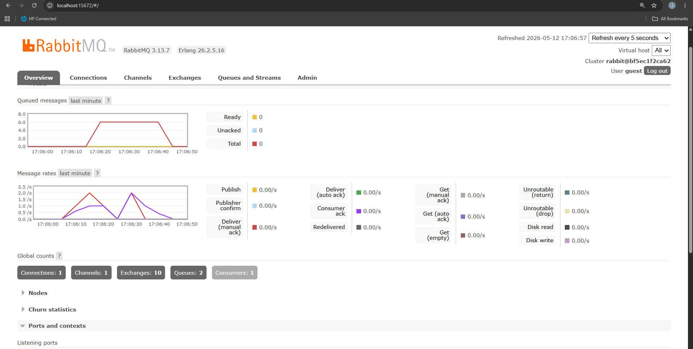
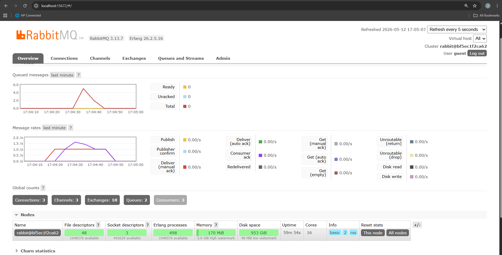
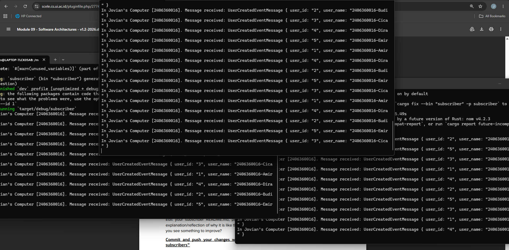

Subscriber Reflection : 
1. AMQP (Advanced Message Queuing Protocol) adalah sebuah protokol standar terbuka pada level application layer yang digunakan untuk mengirim pesan satu sama lain. Dengan adanya protokol ini, memungkinkan pengirim dan penerima untuk saling berkomunikasi walaupun mereka dibuat dengan bahasa pemrograman dan berjalan di platform yang berbeda. Penggunaan AMQP ini juga menjamin pesan terkirim dengan aman dan memiliki sistem antrian yang baik. Dalam tutorial ini, kita juga menggunakan AMQP di crosstown_bus untuk berinteraksi dengan RabbitMQ.

2. guest:guest@localhost:5672 adalah sebuah connection url yang digunakan aplikasi untuk terhubung ke RabbitMQ, berikut penjelasan detailnya : 
- guest (pertama) : username default untuk login ke RabbitMQ
- guest (kedua) : password default untuk username tersebut
- localhost : menunjukkan lokasi server RabbitMQ. Hal ini berarti server tersebut berjalan di komputer yang sama dengan aplikasi kita.
- 5672 : port standar yang digunakan oleh RabbitMQ untuk komunikasi melalui protokol AMQP.

Screenshot slow subscriber graph : 

Explanation : 
Simulasi Slow Subscriber ini bertujuan untuk menunjukkan salah satu fungsi utama message broker seperti RabbitMQ untuk menangani load balancing dan asynchronous processing. Setelah saya menjalankan publisher 5 kali secara cepat, kita dapat melihat hasil grafik pada gambar mengalami kenaikan yaitu puncaknya di 6.0. Hal ini menunjukkan bahwa terjadi perbedaan kecepatan antara publisher dalam mengirim dan subscriber dalam menerimanya sehingga pesan tertumpuk di rabbitMQ. Namun, kenaikan tersebut tidak terlihat signifikan karena dalam tutorial ini kita hanya menggunakan thread::sleep(ten_millis) dimana kecepatan subscriber setelah sengaja dilambatkan masih hampir sama cepatnya dengan publisher sehingga hanya mentok di angka 6 meskipun sudah mengirim 25 pesan (5 kali run).

Screenshot multi slow subscriber graph and terminal : 

Explanation : 
Saat kita menjalankan beberapa subscriber secara bersamaan, maka akan terjadi berikut ini : 
- Pembagian beban : ketika kita menjalankan lebih dari satu terminal subscriber, rabbitMQ akan membagi pesan yang masuk ke semua subscriber yang aktif secara bergantian.
- Pemrosesan Paralel : Seperti yang terlihat di terminal, pesan tidak lagi menumpuk di satu tempat. Subscriber A mungkin memproses "Budi" dan "Dira", sedangkan subscriber B memproses "Amir" dan "Cica".
- Penurunan antrian lebih cepat : Pada grafik RabbitMQ, kia akan lihat bahwa spike akan turun lebih cepat dibandingkan saat hanya ada satu subscriber. Hal ini karena total kapasitas pemrosesan sistem meningkat seiring bertambahnya jumlah subscriber.

Ada beberapa hal yang bisa ditingkatkan : 
- Saat ini, jika sebuah subscriber mengambil pesan lalu tiba-tiba mati sebelum selesai memproses, pesan tersebut bisa hilang jika menggunakan auto-ack. Oleh karena itu, kita bisa menggunakan manual acknowledgement sehingga rabbitMQ hanya menghapus pesan jika subscriber sudah mengirim sinyal bahwa proses selesai. Jika subscriber mati di tengah jalan, rabbitMQ akan mengirim ulang pesan tersebut ke subscriber lain yang tersedia.
- Kode saat ini mungkin belum menangani apa yang terjadi jika data yang dikirim korup atau gagal diproses oleh logika bisnis. Oleh karena itu, kita bisa menambahkan penanganan error dan retry mechanism
- URL rabbitMQ masih tertulis hardcode di kode. Kita bisa menggunakan environment variables untuk menyimpan konfigurasi koneksi agar kode lebih aman.